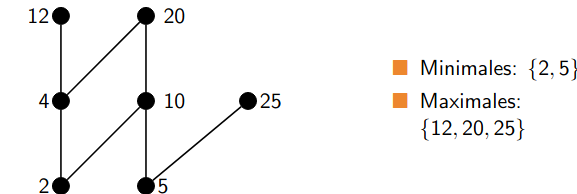

    Elementos comparables 
    Semana 01 - Clase 002

## Definición
Los elementos $a, b$ de un CPO $(S, R)$, se denominarán comparables si $aRb$ ó $bRa$. Es decir si están relacionados de alguna forma, mientras que en caso contrario serán elementos incomparables $(a, b) \in R$ ó $(b, a) \in R$.

> Por ejemplo los elementos $3, 9$ en el CPO $(\mathbb{Z}^{+}, |)$ son comparables, pues $(3, 9) \in R$, mientras que $5, 7$ en el mismo CPO, no lo son.

## Conjunto linealmente ordenado
También denominado conjunto totalmente ordenado, es un CPO $(S, R)$, donde cada par de elementos de $S$ son comparables, puede denominarse totalmente ordenado ó linealmente ordenado.
> Por ejemplo el CPO $(Z, \leq)$ es totalmente ordenado porque $a \leq b$ ó $b \leq a$, donde $a, b \in \mathbb{Z}$. Por ejemplo para el CPO $D_{15}$ no es totalmente ordenado por que $(3, 5)$ son no comparables

## Elementos minimales y maximales
### Maximal
Sea un CPO $(S, \leq)$, el elemento $a \in S$, se denomina maximal si $\nexists b \in S$, tal que $a \leq b \equiv aRb$, donde debe cumplirse que $b \neq a$. En otras palabras, un elemento de un CPO se denomina maximal si este elemento no es menor que cualquier elemento del CPO.
### Minimal
Sea un CPO $(S, \leq)$, el elemento $a \in S$, se denomina minimal si $\nexists b \in S$, tal que $b \leq a \equiv bRa$, donde debe cumplirse que $b \neq a$. En otras palabras, un elemento de un CPO se denomina minimal si este elemento no es mayor que cualquier elemento del CPO.

> Los elementos maximales y minimales son fáciles de identificar en los diagramas de hasse,  pues son los top y bottom del diagrama. Por ejemplo en la relación $S = \{1, 2, 3\}$ en el CPO (P(S), $\subseteq)$, $\empty$ es minimal pues es subconjunto de todo conjunto y $S$ es maximal pues no hay nadie por debajo de el.

## Máximo y mínimo
### Máximo
Un elemento $a$ será el máximo de un CPO $(S, R)$ si $bRa, \forall b \in S$. El máximo es único pues tiene que estar relacionados, tienes que ser "mayor" que todos.
### Mínimo
Un elemento $a$ será el mínimo de un CPO $(S, R)$ si $aRb, \forall b \in S$. El mínimo es único pues tiene que estar relacionados, tienes que ser "mayor" que todos.

> Por ejemplo el CPO $([0, 1[, \leq)$ no tiene máximo, pues al tener un límite abierto existen infinitos números que cumplen con la relación.