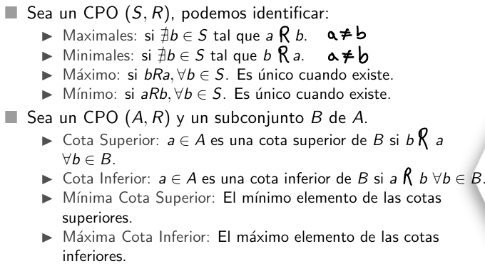

    Cotas Superiores e Inferiores 
    Semana 01 - Clase 003

## Definición
Considérese un CPO $(A, R)$ y un subconjunto $B$ de $A$, tal que existen dos extremos denominados cota superior e inferior, que se definen:
- Un elemento $a \in A$ es una cota superior de $B$ si $bRa \equiv b \leq a$ para toda $b \in B$.
- Un elemento $a \in A$ es una cota inferior de $B$ si $aRb \equiv a \leq b$ para toda $b \in B$.

> Como dato podemos decir que el conjunto de $\mathbb{Z}^{+}$ siempre tendran como máxima cota inferior al número $1$ para los casos de divisibilidad y multiplicación.

## MCS y MCI
Un elemento $a \in A$ es una mínima cota superior (MCS) de $B$ si cumple con las siguientes características:
- $a$ es una cota superior de $B$.
- $a \leq c$, siempre y cuando $c$ sea una cota superior de $B$.

Un elemento $a \in A$ es una máxima cota superior (MCI) de $B$ si cumple con las siguientes características:
- $a$ es una cota inferior de $B$.
- $c \leq a$, siempre y cuando $c$ sea una cota inferior de $B$.

> Teorema de las cotas nos dice que dada la relación $aRb$, la mínima cota superior del conjunto $\{a, b\}$ será $b$, mientras que la máxima cota inferior será $\{a\}$.