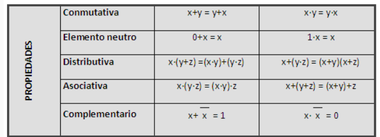
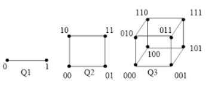

    Álgebra booleana 
    Semana 02 - Clase 007

## Introducción
El álgebra booleana nace de las propiedades de las proposiciones lógicas, el álgebra booleana se utiliza principalmente en compuertas lógicas y circuitos interruptores.

## Definición
Un álgebra booleana tiene la forma $B = (S, +, \cdot, ', 0, 1)$, y consiste en un conjunto $S$ que contiene elementos distintos, donde obligatoriamente está incluido el $0, 1$, que representan el bottom y top respectivamente. Los símbolos $+$ y $\cdot$ son operadores binarios en $S$. Mientras que $'$ es un operador unitario y representa el complemento de un $a \in S$.  

> Considerar que la mínima retícula $S$ ("la más simple"), que cumple ser un álgebra de bool consta de dos elementos, de tal forma que $S = \{0, 1\}$, por lo que $B = \{S, +, \cdot, ', 0, 1\}$. De este modo $0' = 1, 1' = 0$.

Como ejemplo, $(P(S), \cup, \cap, ', \empty. S)$, es un álgebra booleana, pues podemos comprobar que cumple con todas las leyes (4 condiciones).

## Propiedades
Existen dos propiedades principales, que utilizan los complementos, de tal forma que $(a + b)' = a' \cdot b'$. Mientras que su dual es $(a \cdot b)' = a' + b'$. Si nos damos cuenta, lo que cambia es el signo. Mientras que la bonus es $(a + b + c)' = a' \cdot b' \cdot c'$.

Para que sea considerada como álgebra booleana, una retícula debe ser acotada, distribuida y complementada. (Forma alternativa de definirla).

## Retícula cubo n-dimensional
Si el diagrama de hasse de la retícula correspondiente a un conjunto con $n$ elementos es etiquetado mediante sucesiones de ceros y unos de longitud $n$, entonces la retícula resultante se denota como $B_{n}$.

Para considerarse un álgebra de bool, su diagrama de hasse tiene que ser isomorfo al cubo n-dimensional. Además la cantidad de puntos tienen que ser una potencia de dos, tal que $|B_{n}| =  2^{n}, (P(S), \subseteq)$.

> Nota. Si una retícula finita $L$, no contiene $2^{n}$ elementos, para algún entero, no negativo $n$, se sabe que $L$, no puede ser un álgebra booleana.